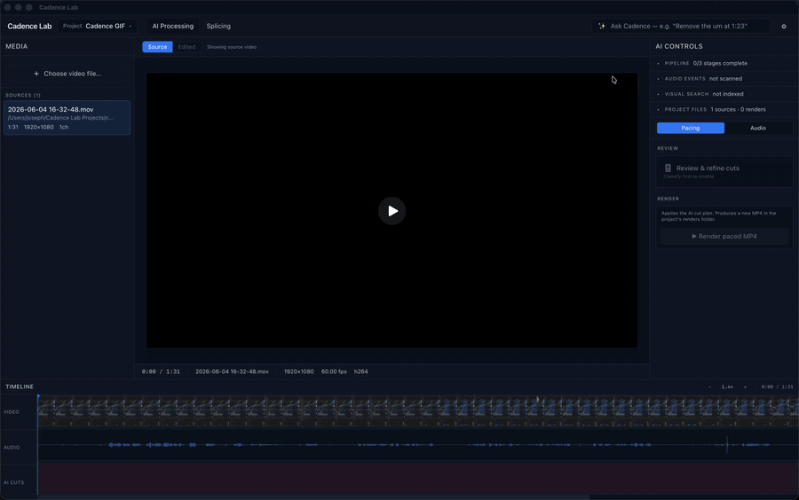

# Cadence Lab

**An AI-driven semantic video editor for YouTube creators.** Drop in any
video file (`.mov`, `.mp4`, `.mkv`, `.m4v`, `.avi`, `.webm`). Cadence Lab
transcribes it with Whisper, asks Claude Opus 4.7 to classify every pause
and filler word *in context* (not by amplitude), plans the cuts as pure
interval algebra, lets you review them with per-cut audio playback, and
renders a YouTube-ready MP4 with hardware-accelerated FFmpeg.

Works on anything with a spoken-word audio track: OBS screen recordings,
podcast videos, camera footage, Zoom recordings, talking-head webcam
captures. Multi-track sources (e.g. OBS's separate mic + desktop audio)
let you point the classifier at just the voice channel for cleaner pause
detection.

Then **Ask Cadence**. Type "remove the um at 1:23", "cut every sniffle",
"find when the walnut table is on screen", or "pull a 60-second highlight
from the demo segment", and Claude executes against the same artifacts via
tool use, proposing actions you accept one click at a time.

Built because every "auto-edit silence" tool I tried was a regex over the
waveform. This one actually thinks about each pause, and now you can talk
to it.



---

## Why this exists (and why it might interest you)

Most automatic video editors are amplitude thresholders: anything quieter than
−30 dB for longer than 0.4 s gets cut. That works for the easy half of the
problem and butchers the other half. It cuts breaths to zero (which sounds
robotic), removes dramatic pauses that were *intentional*, and treats every
"um" the same as every "like." It also can't see retakes: when you flub a
sentence and start over, an amplitude tool keeps both takes; a human editor
keeps the second one.

Cadence Lab is structured as a **typed multi-stage pipeline** where the cut
decisions are made by an LLM that has the full transcript in context, plus
an **agentic chat layer** on top where the same LLM can wield read + action
tools to refine the edit. The novel bits are not in the FFmpeg or the
Whisper integration; those are standard. The interesting parts are:

- **Pause classification as a 7-way decision, not a boolean.** Each gap gets
  labeled `filler` / `hesitation` / `breath` / `emphasis` / `pre_laughter`
  / `transition` / `listening`, each with its own cut behavior. Breaths get
  *trimmed to 150 ms*, not deleted. That's the difference between sounding
  natural and sounding like an AI.
- **Context-aware filler-word judgment.** "Like" used filler-style gets cut;
  "like" used meaningfully ("nothing else *like* it") gets kept. The classifier
  sees the surrounding words to decide.
- **Retake detection.** If the speaker says "let me try that again" or
  re-attempts the same sentence twice, the LLM flags the worse take.
- **Ask Cadence: tool-using Claude over the artifacts.** A separate Claude
  Opus 4.7 conversation gets read tools (`list_pauses`, `get_transcript_around`,
  `search_video_content`, `list_audio_events`) and action tools that propose
  edits (`propose_add_custom_cut`, `propose_set_override`,
  `propose_create_highlight_clip`, …). Actions return as typed proposals;
  the user clicks Apply per item. Long-running scans auto-resume the
  conversation when they finish.
- **Structured outputs via `output_config.format`.** The Claude classifier
  is constrained by a JSON schema so there's no regex parsing, no possibility
  of malformed output. The cut planner consumes typed Pydantic models directly.
- **Prompt caching on the classifier rubric.** The system prompt is wrapped in
  `cache_control: {"type": "ephemeral"}` so re-running on more videos reads
  the rubric from cache (~0.1× input cost on repeat).
- **Hardware encode by default** (`h264_videotoolbox` on Apple Silicon),
  with libx264 as an opt-in "archival" mode. Renders typically run 5–15×
  faster than libx264 -preset slow for delivery-quality output that YouTube
  re-encodes anyway.
- **Per-classifier-item review UI with inline audio.** Listen to a ~3-second
  clip around each proposed cut, override the classifier with a single click,
  re-plan instantly. Override decisions flow back through `apply_overrides()`
  → `plan_cuts()` so the same code path serves both the initial plan and the
  refined plan.
- **Opt-in semantic visual search.** CLIP ViT-B/32 frame embeddings indexed
  at 1 fps. Ask "find the part where the dog appears" and get ranked
  timestamps without watching the whole tape.
- **Opt-in non-speech event detection.** PANNs CNN14 (AudioSet-trained)
  spots sniffles, throat clears, coughs, sneezes, hiccups, burps. Pair with
  Ask Cadence's "remove all sniffles" and it proposes a custom cut per
  detected event.
- **Neural denoise as an alternative engine.** DeepFilterNet (GRU model
  trained on ~100k hrs of speech-noise pairs) sits alongside ffmpeg's
  classical `afftdn`. Significantly better on real-world room noise / fan
  hum / keyboard clicks; ~real-time on CPU.
- **Splicing timeline.** Once Cadence has extracted highlight clips into
  the splice panel, you can rearrange them, drop blank black between, and
  render an assembled clip. Separate code path from pacing-mode render.

If you're building LLM-augmented pipelines and want a reference for
production-quality choices around structured outputs, prompt caching,
agentic tool use, multi-stage data contracts, and progressive disclosure
UI: this is a real working example of all of those.

---

## Pipeline

```
                                    JSON contracts between stages
                                                ▼
 source.mov  ──►  ┌─────────────┐  ──►  ┌──────────────┐  ──►  ┌────────────────┐
                  │  1. Ingest  │       │ 2. Analyze   │       │ 3. Classify    │
                  │             │       │              │       │                │
                  │ ffprobe +   │       │ Silero VAD + │       │ Claude Opus    │
                  │ mic-track   │       │ Whisper      │       │ 4.7: pause +   │
                  │ extraction  │       │ (Groq cloud  │       │ filler classes │
                  │             │       │  or local)   │       │ + retakes      │
                  └─────────────┘       └──────────────┘       └────────────────┘
                                                                       │
                  ┌─────────────┐       ┌──────────────┐       ┌──────────────┐
                  │ 6. Review   │ ◄──── │ 5. Render    │ ◄──── │ 4. Plan      │
                  │             │       │              │       │              │
                  │ per-cut     │       │ FFmpeg       │       │ Interval     │
                  │ audio +     │       │ filter_      │       │ algebra:     │
                  │ accept /    │       │ complex      │       │ classifier   │
                  │ reject /    │       │ (HW encode   │       │ output +     │
                  │ re-plan     │       │  by default, │       │ custom cuts  │
                  │             │       │  optional    │       │ + overrides  │
                  │             │       │  DFN denoise)│       │              │
                  └─────────────┘       └──────────────┘       └──────────────┘
                       ▲                                              │
                       └──────────── re-plan with overrides ◄─────────┘

         ┌────────────────────────── opt-in side branches ──────────────────────────┐
         │                                                                          │
         │   Audio events: PANNs CNN14 → sniffle/cough/throat-clear timestamps      │
         │   Visual search: CLIP ViT-B/32 → frame embeddings (1 fps) → text query   │
         │   Highlight extract: sub-range → splice timeline → assembled MP4         │
         │                                                                          │
         └──────────────────────────────────────────────────────────────────────────┘

         ┌────────────────────────────── Ask Cadence ───────────────────────────────┐
         │                                                                          │
         │   Claude Opus 4.7 with read + propose tools. Operates on the artifacts   │
         │   above. Long-running scans auto-resume the conversation when complete.  │
         │   User accepts each proposed action explicitly, no silent edits.        │
         │                                                                          │
         └──────────────────────────────────────────────────────────────────────────┘
```

Each pipeline stage writes a structured JSON file. The next stage reads
it. You can stop at any stage, edit the JSON by hand, and resume.

---

## Project layout on disk

Sources, artifacts, and renders are organized **per project**. The default
projects root is `~/Cadence Lab Projects/` (override with
`CADENCE_PROJECTS_DIR`).

```
~/Cadence Lab Projects/
└── my-channel-ep-12/                  ← project (slug = kebab-cased name)
    ├── project.json                   ← manifest: sources, AI state, render history
    ├── sources/                       ← copied-mode source videos live here
    │   └── intro.mov
    ├── artifacts/                     ← per-source pipeline outputs
    │   ├── intro.analysis.json        ← stage 2: probe + transcript + VAD
    │   ├── intro.classified.json      ← stage 3: per-pause/filler classifications
    │   ├── intro.plan.json            ← stage 4: keep-segments + audit log
    │   ├── intro.mic.16k.wav          ← intermediate: mic-only audio
    │   ├── intro.mic.denoised-medium.wav  ← intermediate: DFN output (if neural)
    │   ├── intro.events.json          ← opt-in: PANNs audio events
    │   └── intro.frames.npz           ← opt-in: CLIP visual index
    └── renders/                       ← every rendered MP4 (with rNNN prefix)
        ├── r001.intro.paced.mp4
        ├── r002.intro.paced.enhance-medium-neural.mp4
        └── r003.highlight-3-clips.mp4    ← splice renders
```

Reference-mode sources (added via "reference in place" rather than copy)
stay where they are on disk; only their absolute path lives in the
manifest.

---

## Quickstart

### Requirements

- macOS (Apple Silicon recommended for hardware video encoder) or Linux
- Python 3.11+
- `ffmpeg` and `uv` on `PATH`
- Rust toolchain (for the Tauri shell, first build only)

```sh
brew install ffmpeg uv rustup-init && rustup-init -y
```

### Setup

```sh
git clone https://github.com/JosephLeon/cadence-lab.git
cd cadence-lab

# Python pipeline + sidecar
uv sync
cp .env.example .env       # then add your keys

# Frontend + Tauri desktop app
cd app && bun install && cd ..
```

You need two API keys (paste them into the in-app Settings panel via the
gear icon top-right, and they're stored in your OS keychain; the `.env`
route below is the dev fallback):

- **Anthropic**: Claude Opus 4.7 (classifier + Ask Cadence). ~$0.50–$2
  per 30-minute video depending on how much you chat.
  <https://console.anthropic.com/settings/keys>.
- **Groq**: hosted Whisper transcription (~30× realtime, ~$0.05 per
  30 min). Optional if you use the local Whisper backend.
  <https://console.groq.com/keys>.

Dev fallback: set them in `.env` if you'd rather.

```sh
GROQ_API_KEY=...
ANTHROPIC_API_KEY=...
```

### Model downloads on first use

`uv sync` only installs Python packages. The actual ML models download
lazily the first time each feature is used. Plan for:

| Model | Triggers when… | Size | Cached at |
|---|---|---|---|
| Silero VAD | first analyze | ~2 MB | `~/.cache/torch/hub/` |
| CLIP ViT-B/32 | first visual search index | ~150 MB | `~/.cache/clip/` |
| DeepFilterNet | first neural denoise render | ~6 MB | `~/.cache/deepfilternet/` |
| PANNs CNN14 | first audio-event scan | ~320 MB | `~/.cache/panns_data/` |
| Whisper large-v3 (local backend only) | first analyze with `--backend local` | ~1.5 GB | `~/.cache/huggingface/` |

Groq + the default Anthropic Cadence + classifier paths don't download
anything; they're cloud calls.

### Launch the desktop app

```sh
cd app && bun tauri:dev
```

One command. Tauri's `beforeDevCommand` starts the Vite dev server; the
Rust shell spawns the Python FastAPI sidecar (`uv run cadence-lab server`)
on `localhost:27182` and tears it down on app close. First run takes a
few minutes to compile the Rust shell; subsequent runs are instant.

### Or run the pieces separately (frontend-only iteration)

```sh
# Terminal 1: Python sidecar (FastAPI)
uv run cadence-lab server

# Terminal 2: React frontend (Vite dev server)
cd app && bun dev
```

Open <http://localhost:1420>. Same UI, in a browser tab instead of a
native window.

### Or use the CLI

Each pipeline stage is a separate subcommand; they're chained by JSON output.

```sh
uv run cadence-lab probe    recording.mov                    # list audio tracks
uv run cadence-lab analyze  recording.mov                    # → analysis.json
uv run cadence-lab classify recording.analysis.json          # → classified.json
uv run cadence-lab plan     recording.analysis.json          # → plan.json
uv run cadence-lab render   recording.analysis.json          # → edited.mp4
```

The `render` command uses hardware encoding by default on Apple Silicon
(`h264_videotoolbox`, ~5–15× faster than libx264 with quality YouTube can't
distinguish after its own re-encode). Pass `--encoder libx264` for an
archival CPU encode at `-preset slow -crf 18`.

---

## Architecture deep-dive

### Stage 1: Ingest ([`ingest.py`](src/cadence_lab/ingest.py))

Probes the source with `ffprobe`, detects variable frame rate, and extracts
one selected audio track as 16 kHz mono PCM WAV. **Mic-only matters:**
multi-track screen recorders like OBS often route mic and desktop audio to
separate tracks; if the analyzer sees desktop audio, game sounds or
background music will mask the speech pauses we're trying to classify.
Single-track sources (camera footage, phone video, Zoom recordings) just
use track 0 by default.

### Stage 2: Speech analysis ([`speech.py`](src/cadence_lab/speech.py) + [`backends.py`](src/cadence_lab/backends.py))

Two parallel signals on the mic WAV:

- **Silero VAD** produces frame-accurate "speech vs not" boundaries. Used by
  later stages to know exactly where words begin and end, independent of
  what the transcriber thinks was said.
- **Whisper large-v3** produces the transcript with per-word timestamps. The
  default backend is **Groq** (hosted, ~30× realtime, ~$0.05/video); the
  local backend is faster-whisper on CPU as a fallback.

The Groq path transcodes the mic WAV to Opus 64 kbps before upload
(lossless-for-Whisper, ~5× smaller than FLAC). For audio that exceeds Groq's
25 MB upload limit, it splits at silence boundaries detected by `ffmpeg
silencedetect`, transcribes each chunk independently, and stitches the
timestamps back together.

### Stage 3: Classification ([`classifier.py`](src/cadence_lab/classifier.py))

This is the LLM bit. The pre-processor:
1. Computes every word-to-word gap ≥ 250 ms (assigns each a stable ID).
2. Scans the transcript for candidate filler tokens (`um`, `uh`, `like`,
   `actually`, etc., each with a stable ID).
3. Builds an annotated transcript where pauses and filler candidates are
   marked inline:
   ```
   [00:00] Hello «P:0 (0.52s)» everyone «F:0:"um"» welcome to the show.
   ```

Then a single call to Claude Opus 4.7 with:
- `thinking: {"type": "adaptive"}` + `effort: "high"`, so the classifier
  benefits from reasoning across the full transcript
- `output_config: {format: {type: "json_schema", schema: ...}}` so Claude is
  constrained to produce JSON matching our schema; no regex, no parsing
  fragility
- `cache_control: {"type": "ephemeral"}` on the system prompt with the
  classification rubric; subsequent videos read the rubric from cache

The output is per-pause `{category, action, reason}`, per-filler
`{action, reason}`, plus detected retakes.

### Stage 4: Cut planner ([`planner.py`](src/cadence_lab/planner.py))

**Pure interval algebra, no API, no video touched.** Each classifier "cut" or
"trim" decision contributes one or more removal intervals; user/AI-added
**custom cuts** are merged in alongside. The planner merges overlapping
intervals, takes the complement in `[0, duration]` to get keep-segments,
drops slivers shorter than `min_keep_ms`. The original cut-op list is
preserved as an audit log so the review UI can show the *original intent*
even after merging (e.g. a retake that swallowed three filler cuts within it).

### Stage 5: Renderer ([`renderer.py`](src/cadence_lab/renderer.py))

FFmpeg `filter_complex` building one trim per keep-segment for video and one
trim+fade-in+fade-out per keep-segment for audio. Per-segment fades (rather
than `acrossfade`) avoid the time offset `acrossfade` introduces, so video
and audio stay frame-aligned without any sync correction. The whole filter
graph is written to a temp file via `-filter_complex_script` to avoid
command-line length limits with hundreds of cuts.

Encoder defaults: **`h264_videotoolbox`** if available (Apple Silicon hardware
encoder) at `-q:v 65 -realtime 0 -prio_speed 0 -profile:v high`, else falls
back to libx264. Pass `encoder="libx264"` explicitly to force the slow CPU
encode for an archival master.

Audio enhancement supports two engines:

- **Classical** (default): ffmpeg `afftdn` spectral denoise + loudnorm to
  -14 LUFS. Real-time on any CPU, decent for low hum / static.
- **Neural** ([`denoise.py`](src/cadence_lab/denoise.py)): DeepFilterNet
  runs as a pre-pass on the mic WAV; cleaned output is fed to ffmpeg as a
  second input and substituted for the source's mic track in the filter
  graph. The denoised WAV is cached per-strength so re-rendering is free.

### Stage 6: Review UI

Per-classifier-item rows in the right panel. Each row has timestamp,
duration, transcript context (`±6` words around the cut), an inline MP3
clip extracted lazily from the mic WAV (cached), and a one-click override.
Overrides apply through `apply_overrides()` → `plan_cuts()` on render, so
the same code path serves both the initial plan and the refined plan.

### Ask Cadence ([`cadence.py`](src/cadence_lab/cadence.py))

A separate Claude Opus 4.7 conversation with two tool families:

- **Read tools**: `list_pauses`, `list_fillers`, `get_transcript_around`,
  `get_classification_summary`, `get_full_transcript`, `search_video_content`,
  `list_audio_events`. These query the existing artifacts; no model calls
  fan out from them.
- **Action tools**: `propose_set_override`, `propose_clear_override`,
  `propose_add_custom_cut`, `propose_create_highlight_clip`,
  `propose_set_audio_setting`, `propose_run_audio_event_scan`,
  `propose_run_visual_index`. Each returns a typed `ProposedAction` to
  the frontend; the user clicks Apply per item before anything mutates.

When a `propose_run_*_scan` action is applied, the user's last message is
captured. When the (slow) scan finishes, the system synthesizes a follow-up
message like `"(Scan complete, N events found.) Continue with the previous
request: …"`, and Cadence picks up the conversation without the user
having to retype.

### Audio events ([`events.py`](src/cadence_lab/events.py))

PANNs CNN14 (Sound Event Detection model, AudioSet-trained, ~320 MB
checkpoint downloaded on first use). Runs on the mic WAV. Class IDs are
resolved by name at runtime from the canonical AudioSet labels CSV
(fetched from upstream on first run, then cached). Tracked classes:
cough, throat-clear, sneeze, sniff, burp, hiccup. Output is cached as
`<source>.events.json` so subsequent reads are free.

### Visual search ([`vision.py`](src/cadence_lab/vision.py))

`open_clip` ViT-B/32 (OpenAI weights, ~150 MB on first download).
Indexing extracts one frame per second via ffmpeg pipe, encodes each
through CLIP, L2-normalizes, and persists `(timestamps, embeddings)`
as a single `.npz`. A 30-minute video ≈ 1,800 frames × 512 dims × float32
≈ 3.6 MB.

At query time: encode the text with the same CLIP, take a cosine
similarity vector against the cached embeddings, sort, then merge
adjacent matches within ±4 s (you want "where in the video" not
"every frame where").

### Splicing render ([`renderer.py:splice_render`](src/cadence_lab/renderer.py))

A separate top-level render path. Takes a list of `SpliceClipSpec`
(either `kind="video"` with a source path + sub-range, or `kind="blank"`
for synthesized black + silence) and assembles a single MP4. Every input
is normalized to the target geometry (1920×1080 @ 30 fps + stereo 48 k
audio) before concat, so mismatched sources combine cleanly.

---

## Cost per video

At default settings, end-to-end for a 30-minute source video:

| Stage | What | Cost |
|---|---|---|
| Stage 2 (Transcription) | Groq whisper-large-v3 | ~$0.05 |
| Stage 3 (Classification) | Claude Opus 4.7, ~25 K input + ~10 K output tokens | $0.50–$1.50 |
| Stage 4 (Planning) | Local CPU | $0 |
| Stage 5 (Render) | Local CPU/GPU | $0 |
| Ask Cadence | Claude Opus 4.7, ~10–30 K tokens per chat turn (cached aggressively) | $0.05–$0.50 per session |
| Audio events | Local CPU (PANNs CNN14) | $0 |
| Visual search | Local CPU (CLIP ViT-B/32) | $0 |
| Neural denoise | Local CPU (DeepFilterNet) | $0 |
| **Typical total** | | **~$0.60–$2.00** |

The local Whisper backend (`faster-whisper`) is offline + free but ~5–10×
slower than Groq; useful if you don't want audio leaving your machine.

---

## Project layout

```
src/cadence_lab/
├── cli.py        # typer CLI: probe / analyze / classify / plan / render / server
├── server.py     # FastAPI sidecar: all endpoints the Tauri app talks to
├── ingest.py     # ffprobe + ffmpeg mic-track extraction
├── speech.py     # Silero VAD + transcription dispatch
├── backends.py   # Groq + local (faster-whisper) backends, with chunking
├── classifier.py # pause / filler / retake classifier (Claude Opus 4.7)
├── planner.py    # interval algebra → CutPlan (no API, no video)
├── renderer.py   # FFmpeg filter_complex (videotoolbox or libx264) + splice render
├── reviewer.py   # apply_overrides() + per-cut audio clip extraction
├── cadence.py    # Ask Cadence: Claude tool-use loop + propose-action contract
├── events.py     # PANNs CNN14 audio event detection (opt-in)
├── vision.py     # open_clip frame indexing + text query (opt-in)
├── denoise.py    # DeepFilterNet neural denoise (opt-in alternative engine)
├── projects.py   # per-project manifest + sources + render history
├── paths.py      # canonical paths for every artifact (one source of truth)
├── models.py     # pydantic data models (the JSON contract)
└── __init__.py

app/                         # Tauri desktop app
├── src-tauri/               # Rust shell: spawns the sidecar, hosts the webview
└── src/
    ├── App.tsx              # top-level layout + view routing
    ├── components/          # MediaBrowser / Canvas / RightPanel / Timeline /
    │                        # CadencePanel / ReviewPanel / SplicingView / …
    ├── stores/              # Zustand stores (project, splicing, cadence, …)
    ├── hooks/               # usePipeline, useProjectSourceSync, …
    ├── api/                 # typed fetch client for the sidecar
    └── lib/                 # projectDigest (Cadence context), applyCadenceAction
```

---

## What's deferred (and why)

- **Style-profile aggregation.** The review UI's accept/reject decisions die
  with the session today. The architecture called for these to feed a
  per-channel style profile over time. Useful once you've reviewed enough
  videos to have a feel for what patterns to learn.
- **Stream-copy where possible.** The original spec said "stream-copy
  untouched regions, re-encode only across cut boundaries." With hardware
  encode by default, the speedup isn't worth the complexity.
- **Bulk operations in review.** Currently you reject cuts one at a time.
  "Reject all filler cuts under 400 ms" type operations would be useful once
  you have 200+ cuts to review, and Ask Cadence already covers a chunk of
  this informally.
- **MPS / CUDA acceleration for CLIP + DFN.** Both currently run on CPU
  for portability. Apple's MPS backend would help; deferred until the
  rest is stable.

---

## Tech stack

### Backend
- **Python 3.11+**, [`uv`](https://github.com/astral-sh/uv) for dependencies
- **[Anthropic SDK](https://github.com/anthropics/anthropic-sdk-python)**: Claude Opus 4.7
  with adaptive thinking, structured outputs via `output_config.format`,
  prompt caching, tool use loop
- **[Groq SDK](https://github.com/groq/groq-python)**: hosted whisper-large-v3
- **[faster-whisper](https://github.com/SYSTRAN/faster-whisper)**: local fallback transcription
- **[silero-vad](https://github.com/snakers4/silero-vad)**: voice activity detection
- **[panns-inference](https://github.com/qiuqiangkong/panns_inference)**: audio event detection
- **[open-clip-torch](https://github.com/mlfoundations/open_clip)**: CLIP frame embeddings
- **[DeepFilterNet](https://github.com/Rikorose/DeepFilterNet)**: neural speech denoise
- **[FFmpeg](https://ffmpeg.org/)**: all media manipulation; `h264_videotoolbox` or `libx264`
- **[FastAPI](https://fastapi.tiangolo.com/)** + **[Pydantic](https://docs.pydantic.dev/) v2**: sidecar HTTP + typed JSON contracts
- **[Typer](https://typer.tiangolo.com/)**: CLI

### Frontend
- **[Tauri 2](https://v2.tauri.app/)**: native shell (Rust + WKWebView), spawns the Python sidecar
- **React 19 + TypeScript + Vite**: UI
- **[Zustand](https://github.com/pmndrs/zustand)**: state, with write-through persistence to `project.json`
- **[TanStack Query](https://tanstack.com/query)**: async data + caching
- **Tailwind**: styling

---

## License

[MIT](LICENSE). Use it for whatever you want: personal, commercial,
remixing, training your own model on its outputs. Attribution appreciated
but not required.

## Contributing

Issues and PRs welcome. See [CONTRIBUTING.md](CONTRIBUTING.md) for the short
guidelines.
